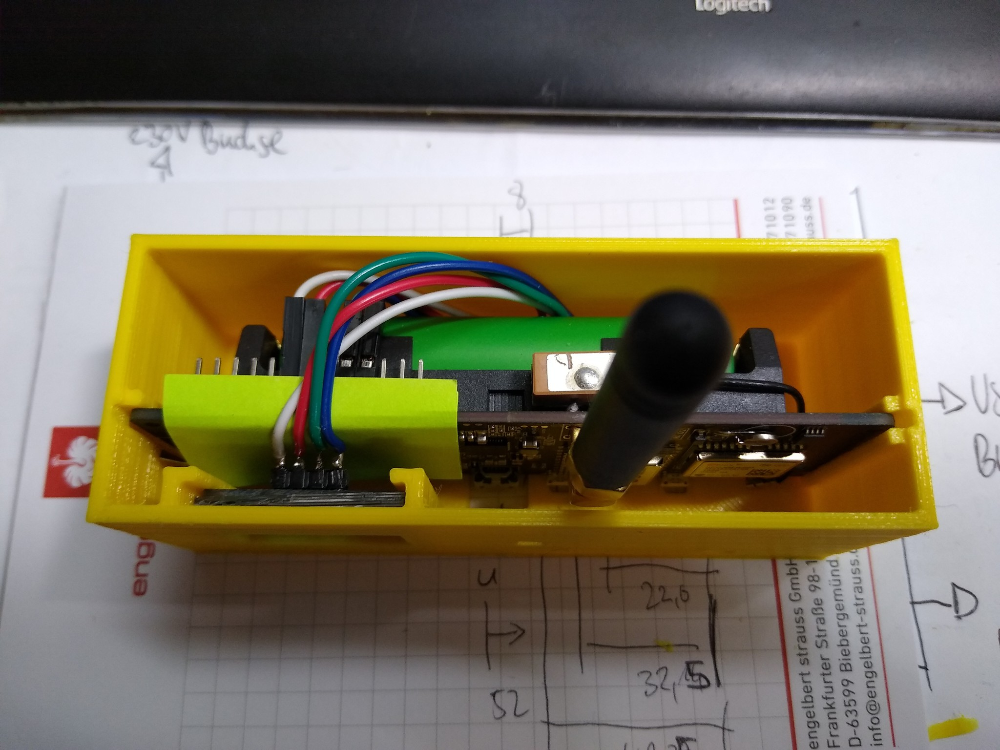
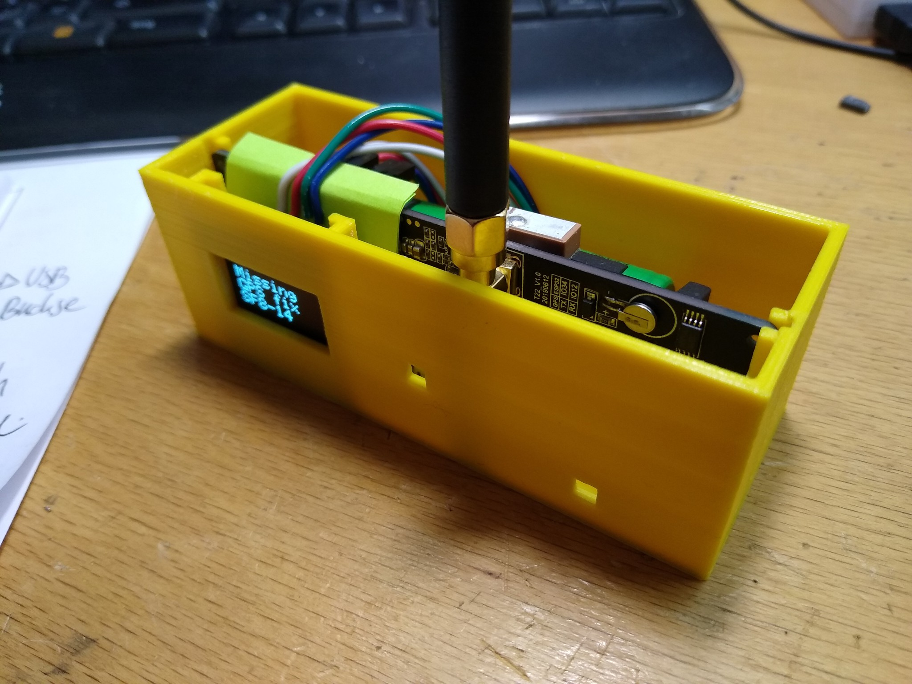

# Lora-TTNMapper-T-Beam-v10

## Summary

Code for a TTNMapper node with GPS running on a [TTGO "T-Beam **v10**"](https://www.amazon.de/DollaTek-T-Beam-Drahtloses-Bluetooth-Batteriehalter/dp/B07RWY36ZY) node, based on [Lora-TTNMapper-T-Beam by DeuxVis](https://github.com/DeuxVis/Lora-TTNMapper-T-Beam)

## Copyright and sources

 * Copyright 2019 sbiermann - https://github.com/sbiermann/Lora-TTNMapper-ESP32
 * Copyright 2019 hottimuc  - https://github.com/hottimuc/Lora-TTNMapper-T-Beam
 * Copyright 2019 DeuxVis   - https://github.com/DeuxVis/Lora-TTNMapper-T-Beam
 * Copyright 2020 noppingen - https://github.com/noppingen/Lora-TTNMapper-T-Beam-v10

## Modifications

Quick & dirty fix for v1.0 (v10) boards:

* Change TX/RX pins in `gps.h`
* Add support for the AXP20X power controller
* Init / switch on the power controller
* More diag output on serial interface
* Display of distance to your mapped "home" gateway

## Get it running

* Add required libraries
* Set TTN `NWKSKEY`, `APPKSKEY` and `DEVADDR` in `config.h`
* Set gateway GPS coordinates to get the distance displayed on your way in `gps.h`
* Change bands if you are not in the EU868 region
* Print my case: Soon

## TTN

* Activation method is set to ABP
* TTN decoder script is [here](TTN-decoder.script)

## Images

